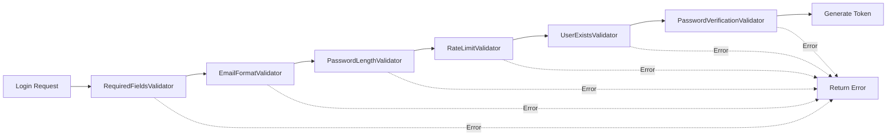

# Chain of Responsibility Pattern - Implementación

## 📚 Descripción

Este proyecto implementa el **patrón Chain of Responsibility** para manejar la validación del proceso de login de usuarios. Este patrón permite encadenar múltiples validadores de forma flexible, donde cada uno se encarga de una responsabilidad específica.

## 🎯 ¿Por qué usar este patrón?

### Ventajas

1. **Separación de Responsabilidades**: Cada validador tiene una única responsabilidad
2. **Fácil de Extender**: Agregar nuevos validadores sin modificar código existente (Open/Closed Principle)
3. **Reusabilidad**: Los validadores pueden reutilizarse en otros contextos
4. **Testeable**: Cada validador puede testearse de forma independiente
5. **Mantenible**: Código más limpio y fácil de mantener
6. **Flexible**: Se puede cambiar el orden de los validadores fácilmente

### Comparación con el código anterior

**Antes (sin patrón):**
```php
public function login(Request $request)
{
    $request->validate([
        'email' => 'required|email',
        'password' => 'required',
    ]);

    $user = User::where('email', $request->email)->first();

    if (!$user || !Hash::check($request->password, $user->password)) {
        throw ValidationException::withMessages([
            'email' => ['Las credenciales proporcionadas son incorrectas.'],
        ]);
    }

    $token = $user->createToken('auth_token')->plainTextToken;
    return response()->json([...]);
}
```

**Después (con patrón):**
```php
public function login(Request $request)
{
    $result = $this->loginService->login([
        'email' => $request->input('email'),
        'password' => $request->input('password'),
    ]);

    if (!$result['success']) {
        return response()->json([...], 401);
    }

    return response()->json([...]);
}
```

## 🏗️ Estructura del Patrón

### Componentes Principales

```
app/Services/
├── ChainOfResponsibility/
│   ├── Contracts/
│   │   └── ValidatorInterface.php         # Interfaz del validador
│   ├── ValidationResult.php               # DTO inmutable para resultados
│   └── AbstractValidator.php              # Clase base abstracta
│
└── Auth/
    ├── Validators/
    │   ├── RequiredFieldsValidator.php    # Valida campos requeridos
    │   ├── EmailFormatValidator.php       # Valida formato de email
    │   ├── PasswordLengthValidator.php    # Valida longitud de password
    │   ├── RateLimitValidator.php         # Limita intentos (Redis)
    │   ├── UserExistsValidator.php        # Verifica usuario en DB
    │   └── PasswordVerificationValidator.php  # Verifica contraseña
    │
    ├── ValidationChainBuilder.php         # Builder para construir cadena
    └── LoginService.php                   # Servicio que usa la cadena
```

## 🔗 Flujo de la Cadena de Validación



## 💡 ¿Cómo funciona?

### 1. ValidationResult (DTO)

Objeto inmutable que representa el resultado de una validación:

```php
$result = ValidationResult::success(['user' => $user]);
// o
$result = ValidationResult::failure('Error message');

if ($result->isSuccessful()) {
    // Éxito
}
```

### 2. ValidatorInterface

Define el contrato que deben cumplir todos los validadores:

```php
interface ValidatorInterface
{
    public function setNext(ValidatorInterface $validator): ValidatorInterface;
    public function validate(array $data): ValidationResult;
}
```

### 3. AbstractValidator

Clase base que implementa la lógica de encadenamiento:

```php
abstract class AbstractValidator implements ValidatorInterface
{
    private ?ValidatorInterface $nextValidator = null;
    
    public function validate(array $data): ValidationResult
    {
        $result = $this->check($data);
        
        if ($result->isFailed()) {
            return $result; // Detiene la cadena
        }
        
        if ($this->nextValidator !== null) {
            return $this->nextValidator->validate($data);
        }
        
        return $result;
    }
    
    abstract protected function check(array $data): ValidationResult;
}
```

### 4. Validadores Concretos

Cada validador extiende `AbstractValidator` e implementa `check()`:

```php
class EmailFormatValidator extends AbstractValidator
{
    protected function check(array $data): ValidationResult
    {
        $email = $data['email'] ?? '';
        
        if (!filter_var($email, FILTER_VALIDATE_EMAIL)) {
            return ValidationResult::failure('Email inválido');
        }
        
        return ValidationResult::success($data);
    }
}
```

### 5. ValidationChainBuilder

Facilita la construcción de la cadena de forma fluida:

```php
$chain = (new ValidationChainBuilder())
    ->add(new RequiredFieldsValidator())
    ->add(new EmailFormatValidator())
    ->add(new RateLimitValidator())
    ->build();
```

### 6. LoginService

Servicio que utiliza la cadena de validación:

```php
class LoginService
{
    public function login(array $credentials): array
    {
        $result = $this->validationChain->validate($credentials);
        
        if ($result->isFailed()) {
            return ['success' => false, 'error' => $result->errorMessage];
        }
        
        // Generar token y retornar...
    }
}
```

## 🧪 Testing

### Tests Unitarios (LoginServiceTest.php)

Testan cada escenario de validación de forma aislada:

```php
test('login falla con email inválido', function () {
    $loginService = new LoginService();
    
    $result = $loginService->login([
        'email' => 'invalid-email',
        'password' => 'password123'
    ]);

    expect($result['success'])->toBeFalse();
});
```

### Tests de Integración (AuthChainTest.php)

Testan el endpoint completo con la cadena:

```php
test('endpoint login funciona con Chain of Responsibility', function () {
    User::factory()->create([
        'email' => 'test@example.com',
        'password' => Hash::make('password123')
    ]);

    $response = postJson('/api/login', [
        'email' => 'test@example.com',
        'password' => 'password123'
    ]);

    $response->assertStatus(200);
});
```

## 🚀 Uso

### Login normal

```bash
curl -X POST http://localhost:8000/api/login \
  -H "Content-Type: application/json" \
  -d '{
    "email": "test@example.com",
    "password": "password123"
  }'
```

### Respuesta exitosa

```json
{
  "success": true,
  "message": "Inicio de sesión exitoso",
  "access_token": "1|abc123...",
  "token_type": "Bearer",
  "user": {
    "id": 1,
    "name": "Test User",
    "email": "test@example.com"
  }
}
```

### Respuesta con error

```json
{
  "success": false,
  "message": "El formato del email es inválido"
}
```

## 🔧 Extensibilidad

### Agregar un nuevo validador

1. **Crear la clase del validador:**

```php
<?php

namespace App\Services\Auth\Validators;

use App\Services\ChainOfResponsibility\AbstractValidator;
use App\Services\ChainOfResponsibility\ValidationResult;

class PasswordComplexityValidator extends AbstractValidator
{
    protected function check(array $data): ValidationResult
    {
        $password = $data['password'] ?? '';
        
        if (!preg_match('/[A-Z]/', $password)) {
            return ValidationResult::failure(
                'La contraseña debe contener al menos una mayúscula'
            );
        }
        
        return ValidationResult::success($data);
    }
}
```

2. **Agregarlo a la cadena en LoginService:**

```php
private function createDefaultChain(): ValidatorInterface
{
    return (new ValidationChainBuilder())
        ->add(new RequiredFieldsValidator())
        ->add(new EmailFormatValidator())
        ->add(new PasswordLengthValidator())
        ->add(new PasswordComplexityValidator())  // ← Nuevo validador
        ->add(new RateLimitValidator())
        ->add(new UserExistsValidator())
        ->add(new PasswordVerificationValidator())
        ->build();
}
```

### Crear una cadena personalizada

```php
// En un controlador o servicio diferente
$customChain = (new ValidationChainBuilder())
    ->add(new RequiredFieldsValidator(['email']))
    ->add(new EmailFormatValidator())
    ->build();

$loginService = new LoginService($customChain);
```

## 📊 Validadores Implementados

| Validador | Responsabilidad | Detiene cadena si... |
|-----------|----------------|---------------------|
| `RequiredFieldsValidator` | Verifica campos requeridos | Falta algún campo |
| `EmailFormatValidator` | Valida formato de email | Email inválido |
| `PasswordLengthValidator` | Valida longitud (8-100) | Password muy corto/largo |
| `RateLimitValidator` | Limita intentos (5 en 5 min) | Demasiados intentos |
| `UserExistsValidator` | Busca usuario en BD | Usuario no existe |
| `PasswordVerificationValidator` | Verifica contraseña | Contraseña incorrecta |

## 🔐 Rate Limiting

El validador `RateLimitValidator` usa **Redis** para limitar intentos:

- **Máximo:** 5 intentos
- **Ventana:** 5 minutos
- **Clave:** `login:{email}`
- **Se limpia:** Después de login exitoso

## 🎓 Principios SOLID aplicados

1. **Single Responsibility**: Cada validador tiene una única responsabilidad
2. **Open/Closed**: Abierto a extensión (nuevos validadores), cerrado a modificación
3. **Liskov Substitution**: Todos los validadores son intercambiables
4. **Interface Segregation**: Interfaces pequeñas y específicas
5. **Dependency Inversion**: Dependemos de abstracciones (interfaces), no de implementaciones concretas

## 📝 Notas Importantes

- El orden de los validadores **importa**
- Los datos se acumulan a través de la cadena (ej: UserExistsValidator agrega el objeto `user`)
- Si un validador falla, la cadena se detiene inmediatamente
- Los validadores son **stateless** y pueden reusarse

## 🧑‍💻 Ejecutar Tests

```bash
# Todos los tests
php artisan test

# Solo tests del patrón
php artisan test tests/Feature/Api/LoginServiceTest.php
php artisan test tests/Feature/Api/AuthChainTest.php
```

## 📚 Referencias

- [Chain of Responsibility Pattern - Refactoring Guru](https://refactoring.guru/design-patterns/chain-of-responsibility)
- [Laravel Rate Limiting](https://laravel.com/docs/11.x/rate-limiting)
- [PSR-12 Coding Standard](https://www.php-fig.org/psr/psr-12/)
